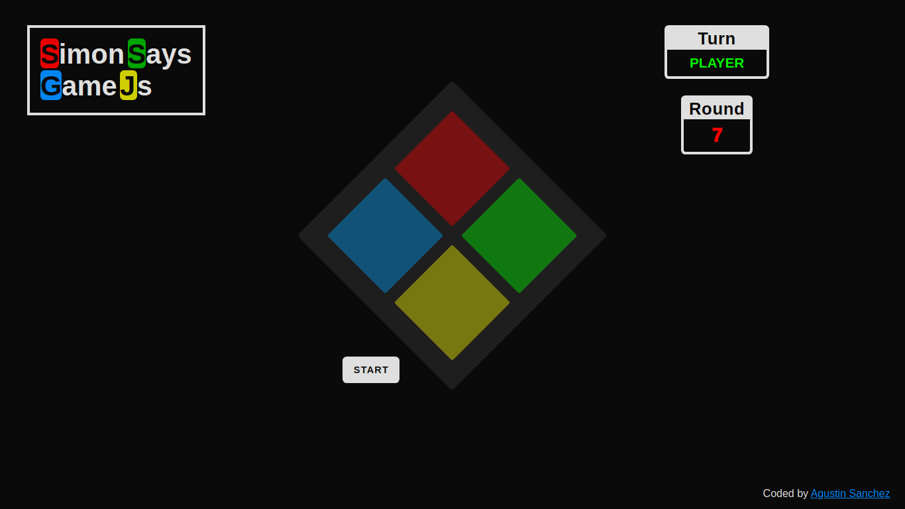
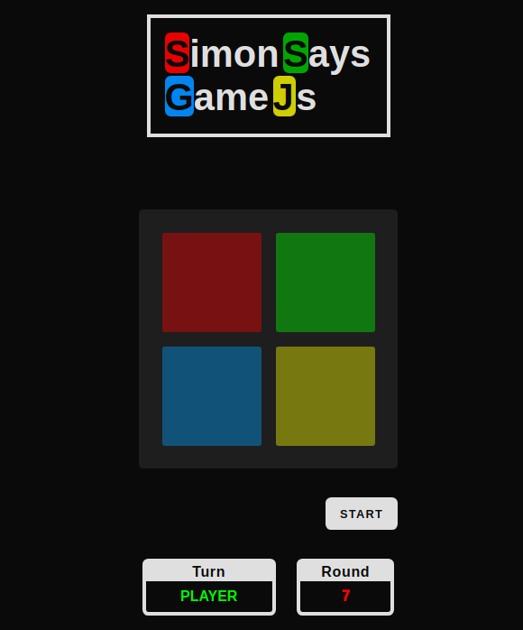

# Simon Says

The classic memory game Simon Says - Made with JavaScript.

- Desktop view

- Mobile view

### Link

- [Live site](https://simon-says-game-js.vercel.app/)

### Built with

 
 
  
 

- Semantic HTML5 markup
- CSS custom properties
- Sass
- Flexbox
- Grid
- Media queries and responsive design
- JavaScript functions, arrays and DOM events

## Author

- Linkedin - [Agustin Emanuel Sanchez](https://www.linkedin.com/in/agustin-emanuel-sanchez-4b2807240/)
- Frontend Mentor - [@agusscript](https://www.frontendmentor.io/profile/agusscript)
- Twitter - [@agus_script](https://twitter.com/agus_script)
